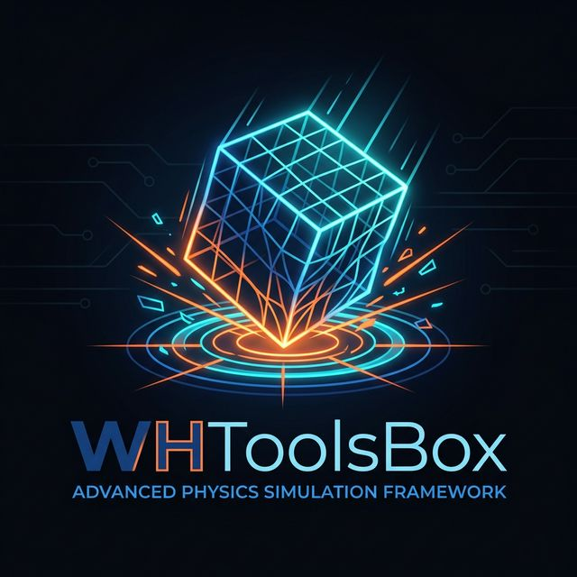

  

  # WHToolsBox
  ### Advanced MuJoCo Drop Simulation & Parameter Optimization Framework

---

## 📖 프로젝트 비전 (Our Vision)
WHToolsBox는 전통적이고 무거운 유한요소해석(FEA) 상용 프로그램이 요구하는 막대한 라이선스와 인프라를 극복하고, Python과 자유로운 물리 엔진(MuJoCo)을 도입해 **초고속 구조 변형·패키징 낙하(Drop Test) 해석 및 관성-충돌 파이프라인**을 완성하는 것을 목표로 설계되었습니다.

특히 이산 블록(Discrete Block Method) 및 유연한 단일 솔리드 계층(Solid Hierarchy) 조합을 바탕으로, **실제 실험 데이터(Physical Droptest Target Curve)와 시뮬레이션의 출력 커브(Loss function)** 간의 오차를 자동으로 감지하고, 해당 제품이 가질 최적의 소재 파라미터(강성 K, 감쇠 C 등)를 기계적 알고리즘으로 **자동 매칭(Automatic Parameter Matching)** 해내는 것을 최종 목표로 삼습니다.

## ✨ 주요 특징 (Key Features)
- **⚡ MuJoCo 기반 초고속 연산 (Speed)**
  수만 개의 이산 블록(Discrete blocks) 및 가상 용접점(Weld constraints)을 1초 안에 셋업하고 멀티코어 솔버로 해석을 가속화합니다. (기존 FEM 모델 대비 압도적인 연산 속도 확보)
- **🧪 충돌(Contact) & 공기 역학(Air Dynamics) 통합**
  바닥 및 부품 간의 유연한 거동(Solref/Solimp 임피던스 제어)은 물론, 압축 공기 쿠션(Squeeze Film Effect)과 드래그 등 유체 역학적 충격 저항까지 사실적으로 계산합니다.
- **🧠 지능형 관성 보정 (Selective Inertia Balancing)**
  Mass, CoG, MoI 중 원하는 항목만 선택적으로 보정하거나 다중 Aux Mass를 자동 배치하여 시스템의 물리적 정합성을 실시간으로 튜닝합니다.
- **🟦 영구 변형(Plasticity) 및 시각적 모니터링**
  충격 시 발생하는 영구 변형(Permanent Deformation)을 물리적으로 계산하며, 변형된 부위가 뷰어에서 푸른색(Blue Tint)으로 강조되어 파손 위험 부위를 직관적으로 식별할 수 있습니다.
- **📊 포괄적 데이터 내보내기 (TXT/Excel Export Data Model)**
  추출된 모든 `DropSimResult` 데이터를 직렬화(pkl)로 캐싱하며, 다중 탭을 가진 Excel 파일(`openpyxl`) 및 TXT 파일 형식으로 G-Force 및 변형도, 진무게중심(True_COG) 좌표 그래프 이미지 등과 한데 묶여 매번 자동으로 레포트화(rds 폴더)됩니다.

## 🧰 파일 구성 및 튜토리얼 (How to Use)
### 1. 전역 환경 및 구성 (Model Generation)
- **`run_discrete_builder.py`**
  - 시스템 초기 상태 및 기본 이산 블록(Discrete Component)들을 생성하는 핵심 건축(Builder) 로직입니다.
  - 박스의 치수, 쿠션의 밀도, 내부 기구물의 분할(Div) 해상도 및 부품 간의 Weld 결합 규칙을 총괄하여 관성(MoI/CoG)을 도출하고 최종 XML로 컴파일합니다.

### 2. 메인 시뮬레이션 실행기 (Run Simulation)
- **`run_drop_simulation.py`**
  - **사용자는 오직 이 스크립트만 실행하면 됩니다.** (`python run_drop_simulation.py`)
  - 낙하 고도(Drop height) 및 자세 지정 모듈(ISTA 방식 로테이션 예: L-F-B)을 호출하여 모델을 생성한 뒤 실시간으로 뷰어(Passive Viewer)를 띄워 모니터링합니다.
  - 가속도 행렬을 물리적으로 분해(Integration)하여 순간 Shock G-Force와 Block Deflection Angle(부품 뒤틀림/굽힘 각도)을 산출해 터미널에 프린트합니다.

## 🚀 향후 로드맵 (Roadmap)
1. **Experiment Target Import**: 사용자의 실제 충격 센서 Z-Profile 커브값 등 실험 CSV 로더 구축
2. **Optimizer Scripting**: SciPy, Bayesian 등 최적화 알고리즘 기반 스크립트를 생성하여 `DropSimResult.pkl` 파싱 값을 기반으로 솔버 파라미터(`solref`/`solimp`) 하이퍼튜닝
3. **Complex Geometry Modeler**: 파이프 격자나 임의 설계 도면(CAD/STL)과의 통합

---
### ⚙️ Environment Details
- **Language**: Python 3 (Anaconda)
- **Engine**: Google DeepMind MuJoCo `mujoco` / `mujoco.viewer`
- **Output Processors**: `matplotlib.pyplot`, `openpyxl`, `numpy`
