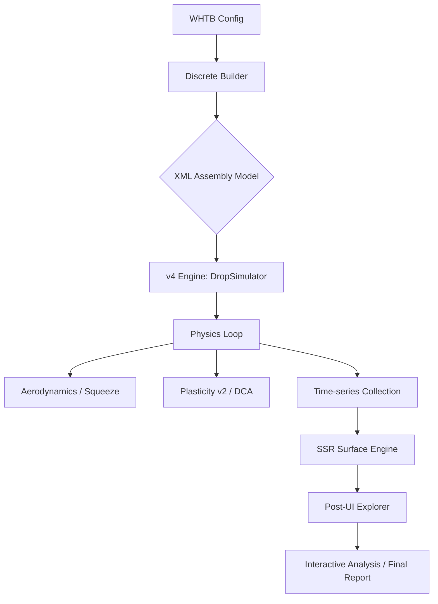

<div align="center">
  

  # 📦 WHToolsBox (v4.x)

  ### 고성능 MuJoCo 기반 정밀 구조 해석 및 이산 블록 낙하 시뮬레이션 프레임워크
  **High-Fidelity MuJoCo Drop Simulation & Structural Surface Reconstruction (SSR) Framework**
</div>

---

## 📖 프로젝트 개요 (Overview)

**WHToolsBox v4.x**는 MuJoCo 물리 엔진의 고속 연산 능력을 극한으로 끌어올려, 단순한 낙하 거동 모의를 넘어 **정밀한 구조 해석(Structural Analysis)**을 수행하는 지능형 엔지니어링 툴킷입니다.

수천 개의 이산 블록으로 구성된 복잡한 어셈블리(Open Cell, Chassis, Cushion 등)를 대상으로 **물리 기반 표면 재구성(SSR)** 알고리즘을 적용하여, FEA 수준의 응력 분포 및 변형 맵을 실시간으로 도출합니다.

---

## ✨ 핵심 기술 패키지 (V4 New Features)

### 1. 🏗️ 정밀 구조 해석 지표 (High-Fidelity Metrics)

- **PBA (Principal Bending Axis)**: 평면 기반 주곡률 해석을 통해 패널의 지배적인 휨 축을 회전 불변(Rotationally Invariant) 특성으로 산출합니다.
- **RRG (Relative Resistance Gradient)**: 국부적인 강성 변화와 변형 저항 기울기를 분석하여 파손 취약 지점을 정밀 탐색합니다.
- **물리적 응력 계산 (BS/TS)**: 쉘 이론(Shell Theory)을 적용하여 굽힘/비틀림 모멘트 및 MPa 단위의 물리적 응력을 정밀하게 계산합니다.

### 2. 🌊 SSR 표면 재구성 엔진 (Structural Surface Reconstruction)

- **Discrete-to-Field Mapping**: 불연속적인 블록 데이터로부터 물리적 연속성을 가진 고해상도 컨투어 맵을 복원하는 전용 엔진입니다.
- **Bicubic Interpolation**: 데이터 스미어링(Smearing) 현상을 억제하고 날카로운 피크 응력을 보존하는 고정밀 보간법을 적용합니다.

### 3. 🖥️ 지능형 포스트 UI (Responsive Post-UI)

- **2D Temporal Animation**: 시계열에 따른 컨투어 변화를 실시간 애니메이션으로 분석하며, 특정 시점의 캡처 기능을 지원합니다.
- **마스터 응답형 레이아웃**: 모든 컨트롤 패널에 마스터 스크롤바와 가로 너비 동기화(Width Sync)를 적용하여 저해상도 환경에서도 완벽한 가독성을 제공합니다.
- **인터랙티브 툴팁**: 멀티 서브플롯 환경에서 마우스 오버 시 모든 그래프의 데이터를 동시에 추적하는 동기화 십자선 기능을 지원합니다.

### 4. 📊 자동화된 리포팅 시스템

- **Final Report v4**: 시뮬레이션 종료 즉시 각 부품별 최댓값 위치(Block Index)와 수치를 테이블 형태로 자동 정렬하여 출력합니다.
- **Data Persistence**: 시뮬레이션 전 과정의 시계열 데이터를 `.pkl` 및 `.xlsx` 형식으로 보존하여 외부 분석 도구와의 호환성을 확보합니다.

---

## 🛠 시스템 아키텍처 (System Architecture)



---

## 🚀 시작하기 (Getting Started)

### 📂 주요 실행 파일 가이드

1. **`run_drop_simulation_cases_v4.py`**: 표준화된 낙하 테스트 시나리오를 실행하는 메인 러너입니다.
2. **`run_drop_simulator/whts_engine.py`**: 물리 연산 및 데이터 수집을 담당하는 v4 핵심 엔진입니다.
3. **`run_drop_simulator/whts_postprocess_ui.py`**: 정밀 분석 UI 프레임워크입니다.

### 💻 실행 방법

```powershell
# 고정밀 낙하 시뮬레이션 배치 실행
python run_drop_simulation_cases_v4.py
```

### ⌨️ 분석 UI 단축키

- `Mouse Wheel`: 컨트롤 패널 및 설정 영역 스크롤
- `Slider / Mouse Over`: 그래프 위에서 실시간 데이터 좌표 및 화살표 가이드 표시
- `SSR Mode Toggle`: 고정밀 표면 재구성 모드 활성화/비활성화

---

## 💡 주요 설정 및 팁 (Configuration & Tips)

> [!important]
> **성능 최적화**: `whts_engine`의 `sim_duration`을 조정하여 필요한 착지 구간만 집중적으로 해석할 수 있습니다.
> - **Cushion Mapping**: `all_blocks_` 접두사가 붙은 지표를 활성화하면 블록 단위의 세밀한 파손 분석이 가능합니다.

---

## 📈 로드맵 (Roadmap)

- [x] PBA/RRG 기반 정밀 구조 해석 지표 통합
- [x] SSR 표면 재구성 엔진 및 고해상도 컨투어 구현
- [x] 마스터 스크롤바 기반 응답형 UI 최적화 (v4.8.x)
- [ ] AI 기반 파라미터 자동 최적화 (Auto-Tuning) 모듈 통합
- [ ] 실시간 충돌 에너지 흡수율(C.E.A) 분석 시스템 구축

---

## 📝 릴리즈 노트 (Release Notes)

### [v4.8.9] - 2026-03-30
- **UI 최적화**: 필드 컨투어 탭의 [Control] 패널을 수직 스태킹 레이아웃으로 변경하여 가시성 확보.
- **마스터 스크롤바**: 모든 분석 탭에 마스터 스크롤바 및 가로 너비 동기화(Width Sync) 적용.

### [v4.8.7] - 2026-03-29
- **버그 수정**: `ttk.Frame`의 `padx` 속성 충돌로 인한 UI 런타임 에러(`unknown option -padx`) 해결.

### [v4.8.6] - 2026-03-29
- **리포트 개선**: 최종 시뮬레이션 결과 테이블의 컬럼 정렬 최적화 및 튜플 인덱스 정렬 기능 보완.

### [v4.8.5] - 2026-03-29
- **워크플로우 개선**: 구조 해석 탭의 플롯 상세 옵션(Max vs All) 위치를 부품 선택 영역 하단으로 이동.

### [v4.8.4] - 2026-03-28
- **인터랙티브 보정**: 멀티 서브플롯 환경에서 마우스 오버 툴팁이 첫 번째 그래프에 고정되던 버그 수정.

### [v4.0.0] - 2026-03-27
- **구조 해석 프레임워크 v4**: PBA, RRG 지표 도입 및 SSR 표면 재구성 엔진 최초 구현.

---

> [!info]
> 안녕하세요, **WHTOOLS**입니다. 본 프레임워크는 단순히 물리 법칙을 모사하는 것을 넘어, 실제 설계 변경에 즉각적인 통찰을 줄 수 있는 **엔지니어링 결과물**을 도출하는 데 최적화되어 있습니다. v4.x의 정교한 지표들이 여러분의 설계 검증 프로세스에 강력한 힘이 되길 바랍니다.

### ⚙️ Environment Details

- **Engine**: MuJoCo 3.x+ (Google DeepMind)
- **Environment**: Python 3.11+ (Conda Recommended)
- **Key Libs**: `mujoco`, `tkinter`, `matplotlib`, `scipy`, `numpy`

---

Copyright (c) 2026 **WHTOOLS** All rights reserved.
