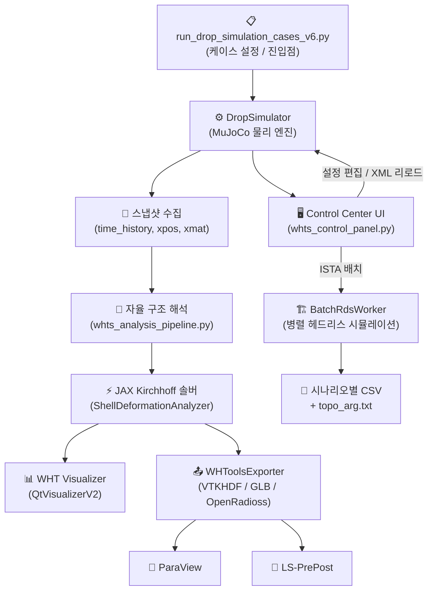

# 🚀 WHTOOLS TV Drop Motion Simulator v6.0

**MuJoCo 기반 TV 패키지 낙하 시뮬레이션 & 자율 구조 해석 통합 플랫폼**

> JAX 자동 미분 가속 · ISTA-6 Amazon 배치 해석 · OpenRadioss FEM 연계 · 실시간 Control Center UI

---

## 📖 개요 (Overview)

WHTOOLS v6.0은 TV 패키지(박스·쿠션·Open Cell·Chassis)의 낙하 충격을 **MuJoCo 물리 엔진**으로 시뮬레이션하고, 마커 궤적만으로 **자율 구조 해석(JAX)**을 수행하는 차세대 엔지니어링 플랫폼입니다.

상용 FEA 소프트웨어 없이도 Von-Mises 응력 분포, 판재 변형장, ISTA 표준 낙하 시퀀스를 단일 워크플로우 안에서 처리하며, **OpenRadioss 및 ParaView**와의 직접 연계를 통해 고정밀 FEM 검증까지 지원합니다.

---

## ✨ v6.0 핵심 기능

### 1. 🖥️ Simulation Control Center (통합 제어 패널)

PySide6 기반의 다크 테마 GUI로 시뮬레이션 전 과정을 단일 창에서 제어합니다.

| 기능 | 설명 |
|------|------|
| **실시간 재생 제어** | Play / Pause / Reset, 슬로우모션, 히트맵 토글 |
| **타임라인 탐색** | 스냅샷 슬라이더, 프레임 단위 이동, 0.1x~10x 배속 |
| **카메라 시점** | +X/-X/+Y/-Y/+Z/-Z/±ISO 원클릭 전환 |
| **모델 파라미터 편집** | 치수·물성·접촉·용접 조건 실시간 수정 (Config Tree) |
| **ISTA 시나리오 선택** | PARCEL / LTL 시퀀스 자동 생성, 낙하 자세 적용 |
| **관성 보정** | 목표 질량·CoG·MoI 입력 → 가상 보정 바디 자동 삽입 |
| **XML 라이브 편집** | MuJoCo XML 직접 편집 및 즉시 재로드 |
| **실시간 파형 모니터** | 마커별 위치/속도 시계열 실시간 표시 |

### 2. 🤖 자율 구조 해석 파이프라인 (Autonomous Structural Analysis)

설계 치수·오프셋 정보 없이 **마커 궤적(3D Trajectory)** 만으로 자율 분석을 수행합니다.

- **JAX 가속 Kirchhoff 박판 솔버**: 수천 프레임을 초 단위로 분석
- **Von-Mises 응력장 자동 계산**: Paperbox · Cushion · Chassis · OpenCell 전 파츠
- **자율 정렬 (Statistical Mode)**: 회전 행렬 없이 마커 데이터만으로 판재 자동 정렬
- **결과 영구 저장**: `results/latest_results.pkl` 자동 저장 (float32 경량화)

### 3. 📤 멀티 포맷 내보내기 (Multi-Format Export)

| 포맷 | 용도 |
|------|------|
| **VTKHDF** | ParaView 연계 — 전 파츠 응력/변형장 시계열 |
| **GLB** | 3D 웹 뷰어용 Von-Mises 응력 메시 |
| **OpenRadioss (.rad/.inc)** | 정밀 FEM 재해석용 모델 파일 |
| **CSV (Corner History)** | ISTA 배치 해석 결과 — Chassis/Cushion/OpenCell 8코너 XYZ 이력 |

### 4. 📦 ISTA-6 Amazon 배치 낙하 해석 (Batch Simulation)

`Dyn.Loads` 기능으로 ISTA 표준 전체 시퀀스를 자동 배치 실행합니다.

- PARCEL / LTL 시험 시퀀스 자동 생성
- 시나리오별 독립 `DropSimulator` 인스턴스로 병렬 헤드리스 실행
- 코너별 XYZ 이력 CSV + `topo_arg.txt` 자동 생성 (위상 최적화 연계)

### 5. ⚙️ 고급 물리 모델

- **쿠션 소성 모델**: 항복 압력 + 경화 계수 기반 비선형 소성 거동
- **공기 유체역학**: 항력(Air Drag) + 스퀴즈 필름 감쇠(Squeeze Film)
- **이산 블록 + Weld 연결**: 분할 블록에 solref/solimp 기반 용접 조건 적용
- **관성 텐서 보정**: 목표 MoI 달성을 위한 가상 fullinertia 바디 자동 계산

---

## 🛠 시스템 아키텍처



---

## 📂 주요 파일 구조

```
TVPackageMotionSim/
├── run_drop_simulation_cases_v6.py   # 메인 진입점 (케이스 설정 및 파이프라인 실행)
├── run_drop_simulator/
│   ├── whts_engine.py                # MuJoCo 물리 루프 및 스냅샷 수집 엔진
│   ├── whts_control_panel.py         # Control Center UI (PySide6)
│   ├── whts_analysis_pipeline.py     # 구조 해석 파이프라인 진입점
│   ├── whts_multipostprocessor_engine.py  # JAX Kirchhoff 솔버
│   ├── whts_multipostprocessor_ui.py      # WHT Visualizer (QtVisualizerV2)
│   ├── whts_exporter.py              # VTKHDF / GLB / OpenRadioss 내보내기
│   ├── whts_radioss_builder.py       # OpenRadioss 모델 빌더
│   └── whts_utils.py                 # 공통 유틸리티
├── run_discrete_builder/
│   └── whtb_config.py                # 기본 설정 및 물성 파라미터
├── resources/
│   └── topo_arg.txt                  # 위상 최적화 인수 템플릿
├── results/                          # 시뮬레이션 결과 저장소
│   └── latest_results.pkl
└── dev_doc/
    └── control_center_manual.html    # Control Center 상세 사용자 매뉴얼
```

---

## 🚀 시작하기 (Getting Started)

### 요구 환경

- Python 3.10 이상
- 주요 의존성: `jax`, `mujoco`, `pyvista`, `pyside6`, `h5py`, `lxml`

```powershell
pip install jax mujoco pyvista pyside6 h5py lxml numpy scipy matplotlib
```

### 실행 방법

```powershell
# Control Center UI와 함께 시뮬레이션 실행
python TVPackageMotionSim/run_drop_simulation_cases_v6.py
```

실행 시 MuJoCo Viewer 창과 Control Center 창이 함께 열립니다.  
Control Center는 MuJoCo Viewer 우측 상단에 자동 정렬됩니다.

### 낙하 케이스 설정

`run_drop_simulation_cases_v6.py` 하단 `__main__` 블록에서 케이스 함수를 지정합니다.  
기본값은 `test_case_1_setup()` (Corner 2-3-5, 낙하 높이 0.3 m)입니다.

```python
if __name__ == "__main__":
    run_digital_twin_pipeline_v6(test_case_1_setup)
```

| 주요 설정 키 | 설명 | 기본값 |
|-------------|------|--------|
| `box_w / box_h / box_d` | 포장 박스 외곽 치수 (m) | 2.056 / 1.200 / 0.178 |
| `assy_w / assy_h` | TV SET 치수 (m) | 1.892 / 1.082 |
| `drop_direction` | 낙하 방향 | `"Corner 2-3-5"` |
| `drop_height` | 낙하 높이 (m) | 0.3 |
| `sim_integrator` | 적분기 | `"implicitfast"` |
| `use_viewer` | Control Center 활성화 | `True` |

---

## 🔬 주요 워크플로우

### A. 단일 낙하 해석

```
설정 편집 → ▶️ 시뮬레이션 실행 → 타임라인 검토 → 🔬 구조 해석 → ParaView/WHT Visualizer
```

### B. ISTA-6 배치 해석

```
크기 및 ISTA 설정 → 🏗️ 동적하중 → 시나리오 체크 → 배치 실행 → CSV 결과 수집
```

### C. OpenRadioss FEM 연계

```
단일 해석 완료 → 목표 시간 지정 → 🏗️ 모델 생성 → ▶️ 엔진 실행 → 👀 LS-PrePost/ParaView
```

자세한 사용법은 [`dev_doc/control_center_manual.html`](dev_doc/control_center_manual.html)을 참조하십시오.

---

## ⚙️ 외부 도구 연동 설정

`external_tools_config.ini`에서 외부 도구 경로를 지정합니다.  
(View 메뉴 → Edit External Tools Config (INI)에서 직접 편집 가능)

```ini
[Tools]
openradioss_path = C:\Program Files\OpenRadioss\engine\...
paraview_path    = C:\Program Files\ParaView\bin\paraview.exe
lsprepost_path   = C:\Program Files\LSTC\LS-PrePost\...
```

---

## 📅 릴리즈 노트 (Release Notes)

### [v6.0] — 2026-06

- **Control Center UI 전면 개편**: PySide6 다크 테마 기반 통합 제어 패널
- **자율 해석 v2**: 마커 궤적 전용 최소 정보(Minimalist) 파이프라인, 회전 행렬 불필요
- **VTKHDF + GLB 내보내기**: ParaView 연계 VTKHDF 시리즈 및 Von-Mises GLB 자동 생성
- **OpenRadioss 빌더**: MuJoCo 낙하 상태 → OpenRadioss 입력 파일 자동 변환
- **ISTA-6 배치 해석**: 병렬 워커 기반 멀티 시나리오 헤드리스 실행 + CSV/topo_arg 출력
- **Assembly Inertia Correction**: 목표 질량·CoG·MoI 가상 fullinertia 보정 자동화
- **Visual Schematic**: 설정 다이얼로그 내 박스/SET/CoG 실시간 2D 스키매틱 미리보기
- **XML Live Editor**: lxml 기반 트리 + 텍스트 에디터 통합, Apply & Reload 지원
- **VTK 경고 억제**: wglMakeCurrent 오류 자동 억제 (`GlobalWarningDisplayOff`)

### [v5.x] — 2026-04~05

- JAX 가속 Kirchhoff 박판 솔버 메인 파이프라인 통합
- WHT Visualizer (QtVisualizerV2) 최초 도입
- PARCEL/LTL 시험 시퀀스 자동 생성 로직

### [v4.x] — 2026-03~04

- PBA/RRG 정밀 구조 해석 지표 도입
- SSR 표면 재구성 엔진 최초 구현
- 마커 기반 Kirchhoff 평판 해석기 (plate_by_markers)

---

## 💎 기술 스택

| 구분 | 라이브러리 |
|------|----------|
| 물리 엔진 | MuJoCo 3.x (Google DeepMind) |
| 가속 연산 | JAX (Google), NumPy, SciPy |
| GUI | PySide6 (Qt 6), PyVistaQt |
| 3D 시각화 | PyVista, VTK |
| 후처리 | ParaView, LS-PrePost, OpenRadioss |
| 데이터 저장 | HDF5 (h5py), Pickle, CSV |
| 환경 | Python 3.10+, Windows 10/11 |

---

**Designed & Built by WHTOOLS Engineering Team.**  
Copyright © 2026 WHTOOLS. All rights reserved.
