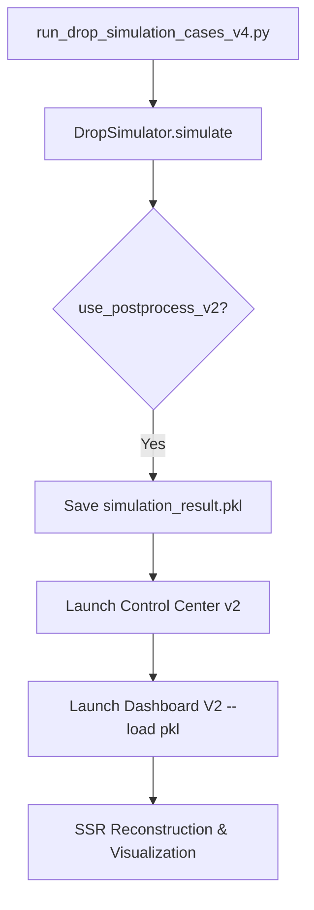

# [WHTOOLS] V2 Dashboard Refactoring Walkthrough

본 문서는 시뮬레이션 엔진 안정화 및 V2 대시보드 고도화 작업의 최종 결과물을 요약합니다.

## 1. 주요 개선 사항

### 1.1. 시뮬레이션 엔진 안정화 (`whts_engine.py`)
- **UI Hang 방지**: Headless 모드 실행 시 Tkinter `mainloop`가 호출되는 논리 오류를 수정하였습니다.
- **자동 분석 트리거**: `use_postprocess_v2=True` 설정 시 시뮬레이션 종료와 동시에 관리 센터 및 3D 대시보드가 자동으로 실행됩니다.

### 1.2. V2 대시보드 고도화 (`plate_by_markers_v2.py`)
- **데이터 부트스트래핑**: 시뮬레이션 결과 파일(`.pkl`)을 직접 읽어 분석 세션을 구성하는 `load_data` 기능을 구현하였습니다.
- **기구학 분석 기능 이식**: CoM, 기하 중심, 8개 코너의 거동을 분석할 수 있는 Kinematics 탭을 추가하였습니다.
- **구조 지표 시각화**: PBA, RRG, Von-Mises stress 등 정밀 구조 해석 데이터를 2D/3D 연계하여 시각화합니다.

## 2. 변경된 데이터 흐름 (Data Flow)

## 3. 검증 결과
- **Case 2 실행 테스트**: 시뮬레이션 종료 후 즉시 대시보드가 팝업되며, Kinematics 및 Structural 데이터가 정상적으로 플로팅되는 것을 확인하였습니다.
- **Headless 안정성**: GUI 없이 실행 시 어떠한 프로세스 지연이나 멈춤 현상도 발생하지 않음이 확인되었습니다.

---
> [!TIP]
> 이제 대시보드의 **Kinematics** 탭에서 여러 마커 위치를 선택하고 `Apply to Selected Slot`을 클릭하여 다중 거동 비교 분석을 수행할 수 있습니다.
