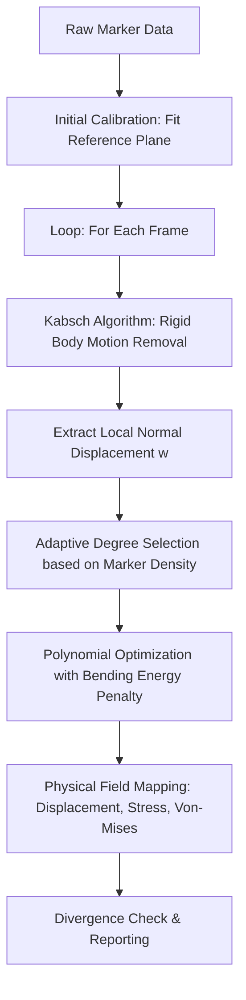

# [WHTOOLS] Integrated Shell Deformation Analysis Algorithm v2.5

**디지털 트윈 기반 마커 추적형 판 변형 해석 알고리즘 명세서**

---

## 1. 개요 (Overview)

본 문서는 가전제품 패키지 및 정밀 구조체의 낙하 충격 시 발생하는 미세 변형을 마커 기반 광학 추적 데이터로부터 물리적으로 재구성하기 위한 알고리즘을 정의합니다. 본 알고리즘은 **강체 운동 제거(Rigid Body Motion Removal)**와 **적응형 표면 근사(Adaptive Surface Fitting)**의 2단계로 구성되며, 기계공학적 판 이론(Plate Theory)을 결합하여 응력 필드를 산출합니다.

---

## 2. 알고리즘 흐름도 (Algorithm Workflow)

---

## 3. 이론적 배경 및 수식 (Theoretical Background)

### 3.1. 강체 운동 제거 (Kabsch Algorithm)
전역 좌표계에서 측정된 마커 데이터 $\mathbf{Q}$에서 순수 변형량을 추출하기 위해, 설계 기준 좌표 $\mathbf{P}$와의 최적 회전 행렬 $\mathbf{R}$과 병진 벡터 $\mathbf{t}$를 산출합니다.

1.  **중심점(Centroid) 계산**:
    $$\bar{\mathbf{P}} = \frac{1}{n}\sum \mathbf{P}_i, \quad \bar{\mathbf{Q}} = \frac{1}{n}\sum \mathbf{Q}_i$$
2.  **공분산 행렬(Covariance Matrix) 산출**:
    $$\mathbf{H} = (\mathbf{Q} - \bar{\mathbf{Q}})^T (\mathbf{P} - \bar{\mathbf{P}})$$
3.  **SVD를 이용한 회전 행렬 도출**:
    $$\mathbf{H} = \mathbf{U}\mathbf{S}\mathbf{V}^T \implies \mathbf{R} = \mathbf{V} \begin{bmatrix} 1 & 0 & 0 \\ 0 & 1 & 0 \\ 0 & 0 & \det(\mathbf{VU}^T) \end{bmatrix} \mathbf{U}^T$$
4.  **로컬 변위 추출**:
    $$\mathbf{Q}_{aligned} = (\mathbf{Q} - \bar{\mathbf{Q}})\mathbf{R}^T + \bar{\mathbf{P}} \implies w = (\mathbf{Q}_{aligned} - \mathbf{P}) \cdot \mathbf{n}_{local}$$

### 3.2. 적응형 표면 근사 (Adaptive SSR)
추출된 면외 변위 $w$를 $x, y$ 좌표의 다항식 함수로 근사합니다.

1.  **다항식 기저함수(Basis Function)**:
    $$w(x, y) \approx \sum_{i=0}^{d_x} \sum_{j=0}^{d_y} a_{ij} x^i y^j$$
2.  **적응형 차수 결정 (Marker-Density-Aware)**:
    측정 데이터의 독립적인 분포 수($N$)를 기준으로 차수를 자동 감차합니다.
    $$d_x = \min(d_{config}, N_x - 1), \quad d_y = \min(d_{config}, N_y - 1)$$
    특히 장단축비(Aspect Ratio)가 큰 경우, 짧은 축의 차수를 1~2차로 제한하여 발산을 억제합니다.

3.  **최적화 목적 함수 (With Physical Regularization)**:

    $$J(\mathbf{a}) = \frac{1}{n} \sum (w_{mesh} - w_{raw})^2 + \lambda \iint \left( \left(\frac{\partial^2 w}{\partial x^2}\right)^2 + \left(\frac{\partial^2 w}{\partial y^2}\right)^2 + 2\left(\frac{\partial^2 w}{\partial x \partial y}\right)^2 \right) dA$$

    여기서 $x, y$는 정규화된 좌표가 아닌 **물리적 좌표계** 기준입니다. 수치적 최적화 시에는 정규화된 기저 함수의 2계 도함수를 물리적 스케일($1/L^2$)로 보정하여 등방성(Isotropic) 물리 특성을 유지합니다.

---

## 4. 주요 개선 사항 (Stability Features)

### 4.1. Min-Max 정규화 (Numerical Stability)
기존의 Z-score 방식 대신 데이터를 $[-1, 1]$ 범위로 선형 매핑하여, 좁은 면에서 분산이 작아질 때 발생하는 수치적 행렬 오류를 방지합니다.

### 4.2. 상대적 마진 (Relative Margin)
해석 영역을 마커 범위 밖으로 확장할 때, 고정값이 아닌 비율(`margin_ratio`)을 적용합니다.
$$\text{Margin} = \text{Dimension} \times \text{Ratio} \in [3\text{mm}, 10\text{mm}]$$

### 4.3. 이상 발산 경보 (Divergence Check)
피팅 결과가 실제 마커 변위의 임계치(예: 1.5배)를 초과할 경우 ⚠️ 경고를 출력하여 데이터 신뢰성을 확보합니다.

---

## 5. 참고 문헌 (References)
1.  **Kabsch, W. (1976)**: "A solution for the best rotation to relate two sets of vectors", *Acta Crystallographica*.
2.  **Kirchhoff-Love Plate Theory**: Timoshenko, S., & Woinowsky-Krieger, S. (1959), *Theory of Plates and Shells*.
3.  **Tikhonov Regularization**: Hansen, P. C. (1998), *Rank-Deficient and Discrete Ill-Posed Problems*.

---
**Documented by WHTOOLS Engineering Team**
**Last Updated: 2026-04-07**
