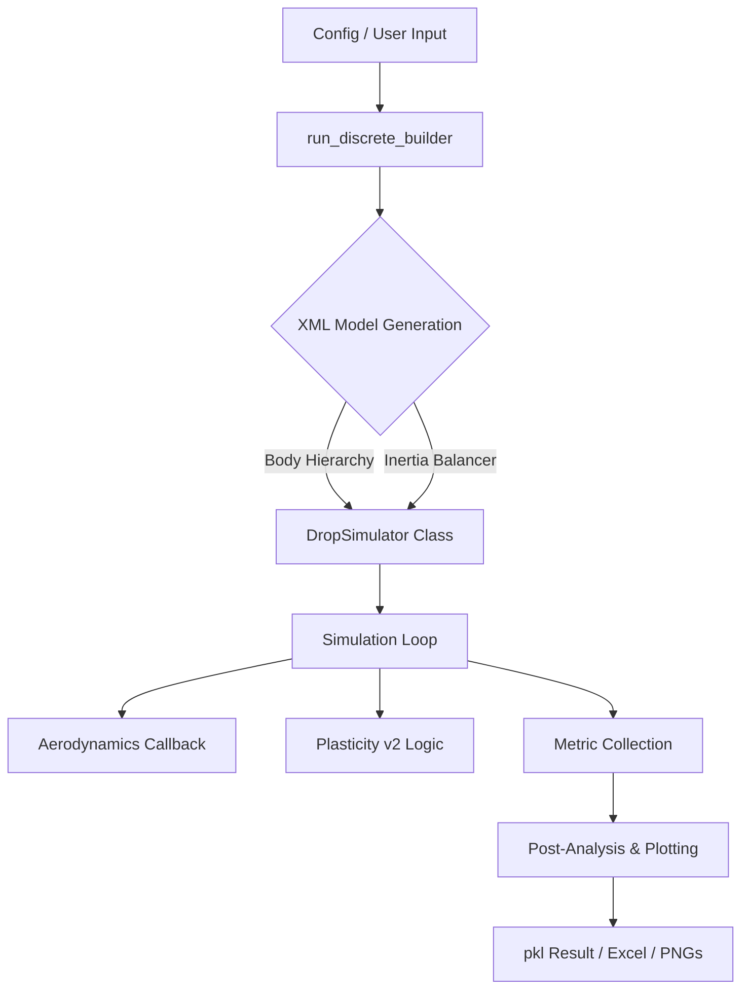

<div align="center">
  

  # 📦 WHToolsBox
  ### 고성능 MuJoCo 기반 이산 블록 낙하 시뮬레이션 및 파라미터 최적화 프레임워크
  **Advanced MuJoCo Drop Simulation & Structural Parameter Matching Framework**
</div>

---

## 📖 프로젝트 개요 (Overview)

**WHToolsBox**는 전통적인 FEA(유한요소해석) 소프트웨어의 무거운 연산 비용과 복잡한 라이선스 제약에서 벗어나, **Python**과 **MuJoCo** 물리 엔진을 결합해 초고속 구조 해석 파이프라인을 구축하는 프로젝트입니다. 

기존 상용 프로그램 대비 **압도적인 연산 속도**를 바탕으로 수천 번의 반복 해석(Iterative Simulation)이 가능하며, 이를 통해 실제 낙하 시험 데이터(Physical Test Data)와 시뮬레이션 결과 간의 오차를 최소화하는 **소재 파라미터 자동 매칭(Automatic Parameter Matching)**을 최종 목표로 합니다.

---

## ✨ 핵심 기술 및 특징 (Key Features)

### 1. ⚡ 초고속 이산 블록 모델러 (Discrete Builder)
- **자동 모델 생성**: 박스, 쿠션, 패널, 섀시 등 복잡한 적층 구조를 수천 개의 이산 블록과 가상 용접점(Weld Constraints)으로 자동 변환합니다.
- **Zero-Weld 고속 모드**: 내부 구속조건을 제거하고 단일 강체 바디에 지오메트리를 통합하여 연산 속도를 10배 이상 향상시키는 최적화 옵션을 제공합니다.

### 2. 🧠 지능형 관성 보정 (Inertia Balancer)
- **8-포인트 대칭 보정**: 설계 원안(Baseline)의 질량, 무게중심(CoG), 관성모멘트(MoI)를 분석하여 타겟 사양에 맞게 8개의 보조 질량을 대칭 배치함으로써 시스템의 물리적 정합성을 완벽히 맞춤니다.

### 3. 🌊 정밀 공기 역학 엔진 (Advanced Aerodynamics)
- **Drag & Squeeze 효과**: 낙하 시 발생하는 공기 저항(Drag)과 지면 착지 직전의 압축 공기 쿠션 현상(Squeeze Film Effect)을 실시간으로 계산하여 해석의 정밀도를 극대화합니다.
- **연산 호이스팅**: 루프 내 중복 연산을 제거하여 고속 해석 환경에서도 물리적 정확도를 유지합니다.

### 4. 🟦 듀얼 트리거 소성 변형 알고리즘 (Plasticity v2)
- **Strain-Pressure 기반 판별**: 인접 블록 간의 **이격 변화(Strain)**와 **충격 지압(Pressure)**을 동시에 감지하여, 단순 탄성 한계를 넘어서는 영구적인 찌그러짐 현상을 물리적으로 재현합니다.
- **Dynamic Axis Detection**: 충격 방향을 자동 감지하여 실제 압착이 일어나는 축 방향으로만 기하학적 형상 축소 및 위치 이동이 일어납니다.

### 5. 📊 고해상도 분석 리포트 (High-Fidelity Reporting)
- **9축 기구학 추적**: 조립체 중심 및 8개 모서리의 위치/속도/가속도 프로파일을 생성합니다.
- **구조 건전성 지표**: 전체 뒤틀림 지수(**TDI**, Total Distortion Index) 및 블록별 굽힘/비틀림 각도를 산출합니다.
- **데이터 시각화**: Matplotlib 기반의 고해상도 PNG 차트와 `DropSimResult` 클래스를 통한 바이너리 패키징을 지원합니다.

---

## 🛠 시스템 아키텍처 (System Architecture)



---

## 🚀 시작하기 (Getting Started)

### 📂 주요 실행 파일 가이드
1. **`run_drop_simulation_v3.py`**: 객체지향(OO) 구조로 리팩토링된 최신 시뮬레이션 엔진입니다. 단독 실행 시 기본 케이스에 대한 해석을 수행합니다.
2. **`run_drop_simulation_cases.py`**: 표준화된 테스트 케이스 러너입니다. (예: 0.5m Corner Drop, 1.0m Face Drop 등)
3. **`run_discrete_builder/__init__.py`**: MuJoCo XML 모델을 생성하는 핵심 빌더 로직입니다.

### 💻 실행 방법
```powershell
# 표준 테스트 케이스 실행
python run_drop_simulation_cases.py
```

### ⌨️ 단축키 안내 (Viewer Mode)
- `Space`: 일시정지 / 재생
- `R`: 시뮬레이션 초기화 (Reset)
- `RightArrow`: 한 스텝(dt)씩 진행
- `Esc`: 시뮬레이션 종료

---

## 💡 주요 설정 (Configuration)

> [!important]
> `solref` 및 `solimp` 파라미터는 모델의 강성과 감쇠를 결정하는 핵심 요소입니다.
> - **Cushion**: `0.05 1.0` (부드러운 흡수)
> - **Chassis**: `0.01 1.0` (강체 거동)
> - **Plasticity**: `cush_yield_strain` 값을 통해 찌그러짐이 시작되는 임계점을 제어합니다.

---

## 📈 로드맵 (Roadmap)
- [x] 객체지향 DropSimulator 클래스 전환
- [x] 듀얼 트리거 기반 소성 변형 알고리즘 정교화
- [x] 고해상도 분석 리포트 자동 생성 시스템 구축
- [ ] 실제 실험 CSV 데이터 로드 및 시뮬레이션 커브 매칭 (Parameter Fitter)
- [ ] 베이지안 최적화 기반 자동 소재 튜닝 모듈 통합

---
> [!info]
> 안녕하세요, **WHTOOLS**입니다. 본 프로젝트는 정교한 물리 시뮬레이션을 통해 공학적 생산성을 높이려는 엔지니어들을 위해 개발되었습니다. 시행착오를 통해 검증된 물리 파라미터와 알고리즘이 여러분의 업무 효율화에 도움이 되길 바랍니다.

### ⚙️ Environment Details
- **Language**: Python 3 (Anaconda)
- **Engine**: Google DeepMind MuJoCo `mujoco` / `mujoco.viewer`
- **Output Processors**: `matplotlib.pyplot`, `openpyxl`, `numpy`, `scipy`

---
Copyright (c) 2026 **WHTOOLS** All rights reserved.
