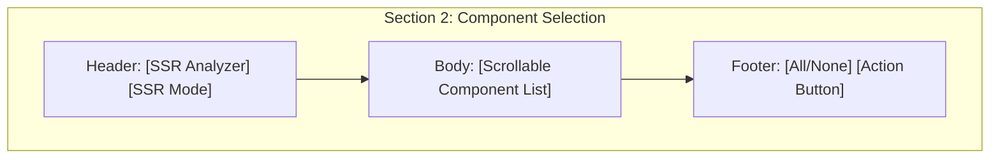

# Walkthrough - UI Component Selection Optimization (Backup 2026-03-30)

I have optimized the layout of the **Component Selection (대상 부품 선택)** section in both the structural and contour analysis tabs. This update specifically addresses the issue where static buttons were interfering with the scrollable list area.

## Changes Made

### 1. Structural Analysis Tab (Tab 2)
- **Header**: Moved the `SSR Analyzer` button and `SSR Checkbox` to a top-aligned frame.
- **Body**: Isolated the component checklist within a dedicated frame, ensuring the scrollbar is correctly scoped to this internal list only.
- **Footer**: Grouped `Select All/None` and `Generate Graph` buttons into a bottom-aligned frame.

### 2. Field Contour Tab (Tab 3)
- **Unified Controls**: Added the `SSR Analyzer` button to the component section for parity with the structural tab.
- **SSR Checkbox Migration**: Moved the `SSR Checkbox` from the options panel to the component selection header.
- **Layout Restructure**: Applied the same Header-Body-Footer architecture to fix scrollbar behavior and UI flow.

## Improved Layout Diagram

## How to Verify
1. Navigate to **Structural Analysis** or **Field Contour**.
2. Observe that the top and bottom buttons remain static while only the component list scrolls.
3. Test the selection buttons to ensure they still control only the items in the current tab.
4. Confirm both tabs offer the same SSR/Analyzer control experience.

> [!TIP]
> This layout allows for much larger component lists without hiding the primary action buttons (like "Generate Graph"), improving accessibility in complex drop scenarios.
